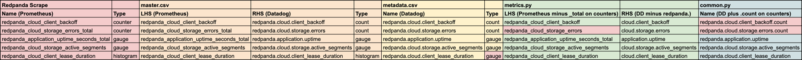

# Metrics Naming Overview

Metrics within the integration change subtly, depending on where in the integration the names exist.

## TL;DR

A summary of how metric names change is available in the following table:



## Details

Let's consider the following scrape from Redpanda:

```text
# HELP redpanda_cloud_client_backoff Total number of requests that backed off
# TYPE redpanda_cloud_client_backoff counter
redpanda_cloud_client_backoff{} 0"
"# HELP redpanda_cloud_storage_errors_total Cumulative count of errors encountered during object storage operations, segmented by direction.
# TYPE redpanda_cloud_storage_errors_total counter
redpanda_cloud_storage_errors_total{} 0"
"# HELP redpanda_application_uptime_seconds_total Redpanda uptime in seconds
# TYPE redpanda_application_uptime_seconds_total gauge
redpanda_application_uptime_seconds_total{} 0"
"# HELP redpanda_cloud_storage_active_segments Number of remote log segments that are currently hydrated and available for read operations
# TYPE redpanda_cloud_storage_active_segments gauge
redpanda_cloud_storage_active_segments{} 0"
"# HELP redpanda_cloud_client_lease_duration Lease duration histogram.
# TYPE redpanda_cloud_client_lease_duration histogram
redpanda_cloud_client_lease_duration_bucket{le=""0.1""} 0
redpanda_cloud_client_lease_duration_bucket{le=""0.2""} 1
redpanda_cloud_client_lease_duration_bucket{le=""+Inf""} 2
redpanda_cloud_client_lease_duration_count{} 3
redpanda_cloud_client_lease_duration_sum{} 20
```

This scrape results in the following metrics:

| Name (Prometheus)                           | Type        |
|---------------------------------------------|-------------|
| `redpanda_cloud_client_backoff`             | `counter`   |
| `redpanda_cloud_storage_errors_total`       | `counter`   |
| `redpanda_application_uptime_seconds_total` | `gauge`     |
| `redpanda_cloud_storage_active_segments`    | `gauge`     |
| `redpanda_cloud_client_lease_duration`      | `histogram` |

---

### master.csv (only in the devkit, not the integration)

This is how the metrics map into the master.csv:

| LHS (Prometheus)                            | RHS (Datadog)                            | Type        |
|---------------------------------------------|------------------------------------------|-------------|
| `redpanda_cloud_client_backoff`             | `redpanda.cloud.client_backoff`          | `count`     |
| `redpanda_cloud_storage_errors_total`       | `redpanda.cloud.storage.errors`          | `count`     |
| `redpanda_application_uptime_seconds_total` | `redpanda.application.uptime`            | `gauge`     |
| `redpanda_cloud_storage_active_segments`    | `redpanda.cloud.storage.active_segments` | `gauge`     |
| `redpanda_cloud_client_lease_duration`      | `redpanda.cloud.client_lease_duration`   | `histogram` |

---

### metadata.csv

This is how the metrics map into the metadata.csv:

| Name (Datadog)                           | Type    | Observation                        |
|------------------------------------------|---------|------------------------------------|
| `redpanda.cloud.client_backoff`          | `count` |                                    |
| `redpanda.cloud.storage.errors`          | `count` |                                    |
| `redpanda.application.uptime`            | `gauge` |                                    |
| `redpanda.cloud.storage.active_segments` | `gauge` |                                    |
| `redpanda.cloud.client_lease_duration`   | `gauge` | **The type has changed to gauge**  |

> Notes:
> 
> * Any histogram metric has its type changed to `gauge`, which is a [Datadog in-app datatype](https://docs.datadoghq.com/metrics/types/?tab=histogram#submission-types-and-datadog-in-app-types).

---

### metrics.py

This is how the metrics are specified in metrics.py:

| LHS (Prometheus minus `_total` on counters) | RHS (Datadog minus `redpanda.`) | Type        | Observation                                                                          |
|---------------------------------------------|---------------------------------|-------------|--------------------------------------------------------------------------------------|
| `redpanda_cloud_client_backoff`             | `cloud.client_backoff`          | `count`     | **RHS has removed `redpanda.`**                                                      |
| `redpanda_cloud_storage_errors`             | `cloud.storage.errors`          | `count`     | **LHS has removed `_total` since it is a counter. <br> RHS has removed `redpanda.`** |
| `redpanda_application_uptime_seconds_total` | `application.uptime`            | `gauge`     | **RHS has removed `redpanda.`**                                                      |
| `redpanda_cloud_storage_active_segments`    | `cloud.storage.active_segments` | `gauge`     | **RHS has removed `redpanda.`**                                                      |
| `redpanda_cloud_client_lease_duration`      | `cloud.client_lease_duration`   | `histogram` | **RHS has removed `redpanda.`**                                                      |

> Notes:
> 
> * Any LHS element that is a `counter` and has a `_total` suffix have that suffix removed.
> * Any LHS element that is a `gauge` will pass through without alteration.
> * All RHS elements are specified without the `redpanda.` prefix, which is a namespace added by the agent.

### common.py

This is how the metrics are specified in common.py:

| Name (Datadog plus `.count` on counters) | Observation                                                        |
|------------------------------------------|--------------------------------------------------------------------|
| `redpanda.cloud.client_backoff.count`    | **A suffix of `.count` was added, since the metric is a counter.** |
| `redpanda.cloud.storage.errors.count`    | **A suffix of `.count` was added, since the metric is a counter.** |
| `redpanda.application.uptime`            |                                                                    |
| `redpanda.cloud.storage.active_segments` |                                                                    |
| `redpanda.cloud.client_lease_duration`   |                                                                    |

> Notes:
> 
> * Any element that is a `counter` will have a `.count` suffix added to the `master.csv` RHS.